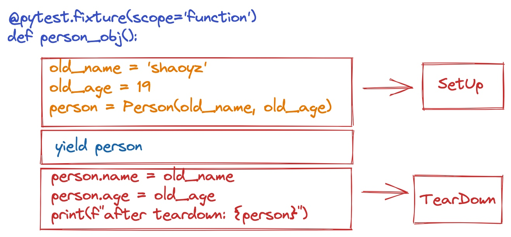

layout: post
title: "Pytest 介绍（part1 基本应用）"
date: 2023-10-19 23:33:19 -0000

# Pytest 介绍（part1-基本应用）
## 什么是pytest
在官方文档中是这么介绍Pytest的：
> The pytest framework makes it **easy to write small, readable tests**, and can **scale to** support complex functional testing for applications and libraries.

## pytest vs unittest
pytest 代码更简洁、紧凑、高效。
unittest更容易上手，但是使用unittest，必须要`import unittest`，创建一个类，在类中定义函数。
例子：
### unit test case
```
from unittest import TestCase

class TryTesting(TestCase):
    def test_always_passes(self):
        self.assertTrue(True)

    def test_always_fails(self):
        self.assertTrue(False)
```
#### 运行unittest code:
`python -m unittest unittest_sample.py`
#### 输出结果：
```
FAIL: test_always_false (unittest_sample.TryTesting)
----------------------------------------------------------------------
Traceback (most recent call last):
  File "/wkspace-self/PytestSampleCode/intro/unittest_sample.py", line 9, in test_always_false
    self.assertTrue(False)
AssertionError: False is not true

----------------------------------------------------------------------
Ran 2 tests in 0.000s

FAILED (failures=1)
```
### pytest case
```
def test_always_true():
    assert True


def test_always_false():
    assert False
```
#### 运行pytest 
`pytest pytest_sample.py`
#### 输出结果
```
platform darwin -- Python 3.9.6, pytest-7.1.1, pluggy-1.0.0
rootdir: /wkspace-self/PytestSampleCode/intro
collected 2 items

pytest_sample.py .F                                                                                                                                                   [100%]

================================================================================= FAILURES ==================================================================================
_____________________________________________________________________________ test_always_false _____________________________________________________________________________

    def test_always_false():
>       assert False
E       assert False

pytest_sample.py:7: AssertionError
========================================================================== short test summary info ==========================================================================
FAILED pytest_sample.py::test_always_false - assert False
======================================================================== 1 failed, 1 passed in 0.03s ========================================================================
```
另外，在控制台执行时，pytest输出的内容会更直观，失败的部分会`标红`。

## 怎么使用pyest
后面的内容主要分成以下三个部分：
 - pytest 的安装、输出结果介绍和运行方式
 - 如何使用pytest fixture
 - pytest 配置文件

### pytest 安装、输出结果和运行方式
#### 安装
`pip install pytest`
#### 输出结果
 - PASSED(.) - test run successfully
 - FAILED(F) - test did not run successfully
 - SKIPPED(s) - the test was skipped. use the decorator: `@pytest.mark.skip()` or `@pytest.mark.skipif()`
 - XFAIL(x) - not supposed to pass, and it run and failed. use `@pytest.mark.xfail()` to tell pytest that the a test is expected to fail.
 - XPASS(X) - the test was marked with xfail, but it ran and passed.
 - ERROR(E) - An exception happened either during the execution of a fixture or hook function, and not during the execution of a test function.
 
 `PASSED` 和 `FAILED` 比较简单，重点看下 `SKIPPED` 
##### pytest.mark.skip
跳过测试函数的最简单方法是使用可以传递可选参数（`reason`）的 `pytest.mark.skip` 装饰器对其进行标记：
```
 @pytest.mark.skip(reason="no way of currently testing this")
def test_the_unknown():
    ...

```
另外，也可以在测试函数执行的过程中，因为某些逻辑，执行 `skip`动作，这个是通过`pytest.skip()`函数实现的。
eg:
```
def test_function():
    if not valid_config():
        pytest.skip("unsupported configuration")
```
##### pytest.mark.skipif
- 在已知某些条件下，需要跳过skip 测试函数，可以通过`pytest.mark.skipif` 函数实现。
eg:

```
import sys
@pytest.mark.skipif(sys.version_info < (3, 10), reason="requires python3.10 or higher")
def test_function():
    assert 3 == 3
```
- 如果有多个函数因为同样的原因导致需要跳过测试，可以通过如下的方式简化：
在`conftest.py`中定义：
```
minversion = pytest.mark.skipif(
    mymodule.__versioninfo__ < (1, 1), reason="at least mymodule-1.1 required"
)
```
引用minversion
```
from conftest import minversion
@minversion
def test_function():
    assert 3 == 3
```
- 跳过一个`class`的测试函数
```
@minversion
class TestSampleClassForSkip: # class 必须以Test开头
    def test_fun1(self):
        assert True

    def test_fun2(self):
        assert True
```
- 如果你想跳过一个模块的所有测试功能，你可以使用全局的 `pytestmark`
eg:
```
"""
介绍pytest的输出结果，举例说明
"""
import pytest
import sys
from conftest import minversion
pytestmark = pytest.mark.skip(reason="功能废弃")
```
这样输出的结果如下（执行 pytest intro_pytest.py）：
> platform darwin -- Python 3.9.6, pytest-7.1.1, pluggy-1.0.0
rootdir: /wkspace-self/PytestSampleCode/intro
collected 6 items
intro_result.py ssssss

执行 `pytest -v intro_pytest.py`:
> platform darwin -- Python 3.9.6, pytest-7.1.1, pluggy-1.0.0 -- /.pyenv/versions/3.9.6/bin/python
cachedir: .pytest_cache
rootdir: /wkspace-self/PytestSampleCode/intro
collected 6 items
>
>intro_result.py::test_with_success SKIPPED (功能废弃)                                                                                                                 [ 16%]
intro_result.py::test_with_fail SKIPPED (功能废弃)                                                                                                                    [ 33%]
intro_result.py::test_skip SKIPPED (预留接口，暂时不支持)                                                                                                             [ 50%]
intro_result.py::test_skip_if SKIPPED (功能废弃)                                                                                                                      [ 66%]
intro_result.py::TestSampleClassForSkip::test_fun1 SKIPPED (功能废弃)                                                                                                 [ 83%]
intro_result.py::TestSampleClassForSkip::test_fun2 SKIPPED (功能废弃)
- 如果多个skipif 装饰器应用到一个测试函数上，只要有一个skip condition 为 `True`，就会跳过执行该测试函数。

##### XFAIL 预计失败，实际失败
用法：
```
@pytest.mark.xfail
def test_function():
    ...

# 或者
def test_function():
    if somecondition:
        pytest.xfail("failing reason")
        # xfail之后的代码不会执行，因为xfail会通过抛出异常，中断执行的逻辑
```
###### 参数
 - reason 可以通过`reason` 参数执行预期失败的动机或原因
 - raises 参数预计会抛出某种异常，实际也抛出了 raises 指定的异常。
     ```
     @pytest.mark.xfail(raises=RuntimeError)
     def test_function():
        raise RuntimeError()
     ``` 
 #### pytest 运行方式

 - `pytest`: no arguments, searches the local directory and subdirectories for `tests`.
 - `pytest <filename>`: runs the tests in one file.
 - `pytest <filename> <filename> ..`:runs the tests in multiple named files.
 - `pytest <dirname>`: starts in a particular directory (or more than one) and recursively searches for tests(test_xx.py 形式的文件)
    ```
    pytest intro
    intro/test_result.py .Fssssx
    ```
 - `pytest <filename>`::test_function : test single test function
 
    
    ```
    pytest intro_result.py::test_with_fail
    ```
 -  `python <filename>::TestClass` : all tests in class
    ```
    pytest intro/intro_result.py::TestSampleClassForSkip
    ```
 - `pytest path`: test all tests in a directory
    ```
    pytest intro
    ```
 - `pytest -k pattern`: tests matching a name pattern
    ```
    pytest -v -k runtime
    ```
    ```
    platform darwin -- Python 3.9.6, pytest-7.1.1,   pluggy-1.0.0 -- /.pyenv/versions/3.9.6/bin/python
    cachedir: .pytest_cache
    rootdir: /Users/songguo77/wkspace-self/PytestSampleCode/intro
    collected 7 items / 6 deselected / 1 selected
    test_result.py::test_raise_runtime_error XFAIL
    ```
## pytest Fixtures
比较流行的测试函数的结构有两种：
 - Arrange-Act-Assert
 - Given-When-Then
遵循这种分层的结构，会使得测试函数更易于维护。
- Given/Arrange: A starting state. This is where you set up data or the environment to get ready for the action.
- When/Act: Some action is performed. This is the focus of the test—the behavior we are trying to make sure is working right.
- Then/Assert: Some expected result or end state should happen. At the end of the test, we make sure the action resulted in the expected behavior.

> “ test fixtures refer to the mechanism pytest provides to allow the separation of “getting ready for” and “cleaning up after” code from your test functions.”
### 如何创建一个fixture？
可以通过 `@pytest.fixture` 装饰器标记一个函数是一个fixture
```python
import pytest

class Fruit:
    def __init__(self, name):
        self.name = name

    def __eq__(self, other):
        return self.name == other.name

@pytest.fixture
def my_fruit():
    return Fruit("apple")

@pytest.fixture
def fruit_basket(my_fruit):
    return [Fruit("banana"), my_fruit]

def test_my_fruit_in_basket(my_fruit, fruit_basket):
    assert my_fruit in fruit_basket
```
**因为测试用例和feature 中都可以使用feature，那么，pytest如何知道哪些是feature哪些不是呢？**
答案是通过测试用例 或者 feature 的参数。当pytest 运行一个测试用例时，它会查看测试函数签名中的参数，然后搜索与这些参数名称相同的feature，一旦pytest找到，就会运行这些 `feature`，捕获它们返回的内容，并将这些对象作为参数传递给测试函数。
 
测试用例可以使用多个 `feature`，`feature` 通过参数传递给测试用例。
例如上面的代码中的 函数 `test_my_fruit_in_basket`，feature `my_fruit` 和 `fruit_basket` 作为参数传递给函数。
### fixture 的特征
#### Fixtures can request other fixtures
#### Fixtures are reusable
多个测试用例可以使用同一个`feature`，同时`feature` 针对这些测试用例是相互隔离的，不会互相影响。
#### A test/fixture can request more than one fixture at a time
一个测试用例或者 `feature`一次可以使用多个 `feature`（多个feature 作为测试用例或者其它 `feature`）的入参。
#### Fixtures can be requested more than once per test (return values are cached)
一个测试用例中调用了 `feature`多次，feature 执行一次 还是多次？
eg：
```
# contents of test_append.py
import pytest

# Arrange
@pytest.fixture
def first_entry():
    return "a"

# Arrange
@pytest.fixture
def order():
    return []

# Act
@pytest.fixture
def append_first(order, first_entry):
    return order.append(first_entry)


def test_string_only(append_first, order, first_entry):
    # Assert
    # append_first -> order = ['a']
    # order 已经缓存，第二个参数order 此时就是缓存下的数据
    assert order == [first_entry]
```

### 将pytest fixture 应用于 SetUp and TearDown场景


测试函数：
```
def test_update_person(person_obj):
    person_obj.name = 'shixi'
    person_obj.age = 32
    print(f'function: {person_obj}')
```
执行命令：`pytest -s intro_result.py::test_update_person`
-s 或者 `–capture=no`可以输出所有测试中执行的print信息。
```
platform darwin -- Python 3.9.6, pytest-7.1.1, pluggy-1.0.0
rootdir: /wkspace-self/PytestSampleCode/intro
collected 1 item

intro_result.py function: Person(shixi,32)
.after teardown: Person(shaoyz,19)
```
### autouse feature(fixtures you don’t have to request)
自动执行的 `feature`，不需要你 explicit 使用。
当你知道所有的测试用例都会依赖它，`autouse feature` 是一种所有测试用例都会自动执行的 `feature`。
方法：
在 `@pytest.feature` 装饰器中，设置 `autouse=True`。
eg：
```
# contents of test_append.py
import pytest


@pytest.fixture
def first_entry():
    return "a"


@pytest.fixture
def order(first_entry):
    return []


@pytest.fixture(autouse=True) # 自动执行
def append_first(order, first_entry):
    return order.append(first_entry)

# 因为append_first 自动执行，所有order 结果被缓存下来
def test_string_only(order, first_entry):
    assert order == [first_entry]


def test_string_and_int(order, first_entry):
    order.append(2)
    assert order == [first_entry, 2]
```

### 如何使用pytest 输出log信息
- 配置文件部分：
```
[pytest]
log_cli = true
log_cli_level = DEBUG
log_format = %(asctime)s (%(filename)-16s:%(lineno)-3s) %(levelname)-8s %(message)s
log_date_format = %Y-%M-%D %H:%M:%S
```
- 代码部分：
```
def test_update_person_with_log(person_obj):

    logger = logging.getLogger('person') # logger 可以在定义成fixture，这里只是展示如何使用
    person_obj.name = 'shixi'
    person_obj.age = 32
    logger.debug(f'function: {person_obj}')
```
这样就可以在执行测试的过程中看到具体的执行细节。


- 命令行控制log的级别
通过参数 `--log-cli-level=LOGGER_LEVEL`完成控制

### 如何跟踪pytest fixture的执行 `--setup-show`


### 指定pytest fixture 的作用范围
pytest 默认的`scope` 是`function`，也就是每个使用了`function`范围的fixture的测试函数，都会执行一遍该fixture的构造，这个可以通过 参数 `--setup-show`来确认。

pytest fixture的作用范围包括：
- scope=`function` “Run once per test function”
- scope=`class` “Run once per test class, regardless of how many test methods are in the class.”
- scope=`module` “Run once per module, regardless of how many test functions or methods or other fixtures in the module use it.”
- scope=`package` “Run once per package, or test directory, regardless of how many test functions or methods or other fixtures in the package use it.”
- scope=`session` “Run once per session. All test methods and functions using a fixture of session scope share one setup and teardown call.”
另外，还可以动态的变更 `fixture`的作用范围。这可以通过 `scope=callback`的方式实现。

To do that, pass a callable to scope. The callable must return a string with a valid scope and will be executed only once - during the fixture definition. It will be called with two keyword arguments - fixture_name as a string and config with a configuration object.
```
def determine_scope(fixture_name, config):
    if config.getoption("--keep-containers", None):
        return "session"
    return "function"

@pytest.fixture(scope=determine_scope)
def docker_container():
    yield spawn_container()
```
### 如果pytest 执行feature过程中出现错误，会怎样？
pytest 会把一个给定测试的所有 fixture 按照线性的顺序执行，如果一个较早的 fixture 出现了问题，并引发了异常，pytest 将停止执行该测试的 fixture，并将该测试标记为有`ERROR`

### 通过conftest.py 共享 pytest fixture
你可以在任何py文件中定义fixture，但是，如果你想要在多个测试文件中共享fixture，就需要把fixture定义在`conftest.py`中，`conftest.py`可以和测试文件处于同一个目录，或者父级目录中。
**注意：**
“Although conftest.py is a Python module, it should not be imported by test files. The conftest.py file gets read by pytest automatically, so you don’t have import conftest anywhere.”

### 如何找到fixture 在哪个文件中定义的
因为`conftest.py` 可以在多个目录级别存在，父级目录下`conftest.py`  中的fixture都可以被当前测试文件使用，那么问题是怎么才能找到这个fixture？
eg: 有如下目录结构


在sub_test中的`test_fixture.py`使用了intro目录下的`conftest.py`中定义的fixture
```
def test_cur_person_name(person_obj):
    assert person_obj.name == 'shaoyz'
```
常用的方法：
- `pytest fixtures ` 输出所有的内置/自定义的features
- `pytest fixtures -v` 输出所有的内置/自定义的features以及对应的docstring
- `pytest --fixtures-per-test intro/sub_test/test_fixture.py` 输出指定的测试函数/模块 使用到的fixture信息


## 引用
https://github.com/pytest-dev/pytest/pull/2511
https://docs.pytest.org/en/7.1.x/how-to/fixtures.html
