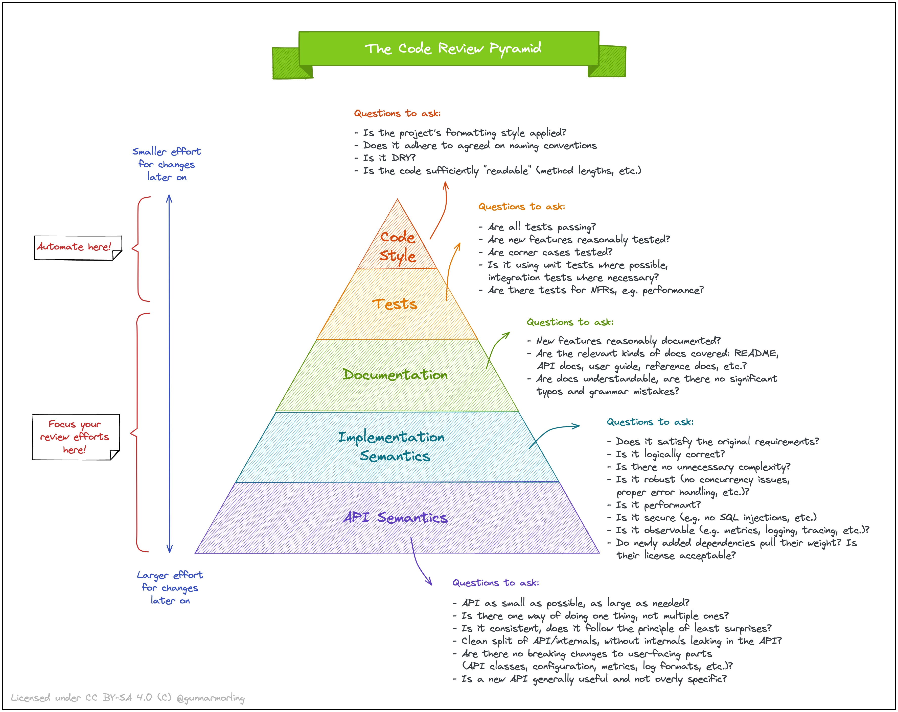

layout: post
title: "如何做代码审查？"
date: 2023-10-19 23:33:19 -0000

# 如何做代码审查？
## code style
- Is the Project‘s formatting style applied?
- Does it adhere to aggreed on name conventions?
- Is it dry?
- Is the code sufficienty "readable"? (method length ...)

## Tests
 - Are all tests passing ?
 - Are new features reasonably tested ?
 - Are corner cases tested ?
 - Is it using unit tests where possible, integration tests where necessary ?
 - Are there tests for NFR, eg. performance ? 

上面的部分，应该通过工具进行审查
----------
----------

----------
 后面的部分，才是代码评审员应该关注的地方
## Documents
 - new features reasonably documented?
 - Are the relevant kinds of docs covered: README, API DOC user guide, reference doc, etc.
 - API docs, understandable, are there no significant types and grammer mistakes?
## Implementation semantics
 - Does it satisfy the original requirements?
 - is it logically correct ?
 - is there no uncessary complexity?
 - is it robust ? no current issues and proper error handling, etc
 - is it performant?
 - is it secure (no sql injections. etc)?
 - is it observable (metrics, logging, tracing, etc)?
 - do newly added dependencies pull their weight? is their license acceptable?
## API Semantics
- API as small as possible, as large as needed?
- is there one way of doing one thing, not multiple ones?
- is it consistent, does it follow the principle of least surprises?
- clean split API/internals, without internals leaking in the API?
- are there no breaking changes to userfacing parts 
    - (API classes, configuration, metrics, log formats, etc? )
    - Is a new API generally useful and not overly specific?

引用：
https://www.morling.dev/images/code_review_pyramid.svg