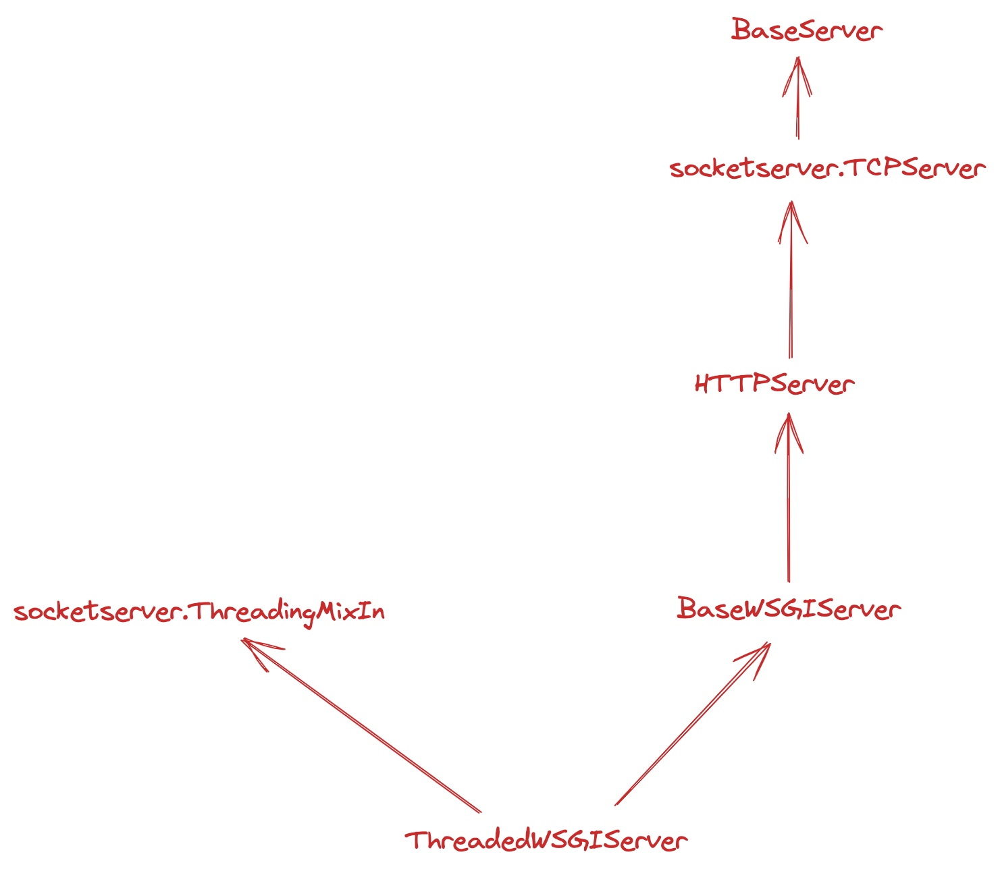
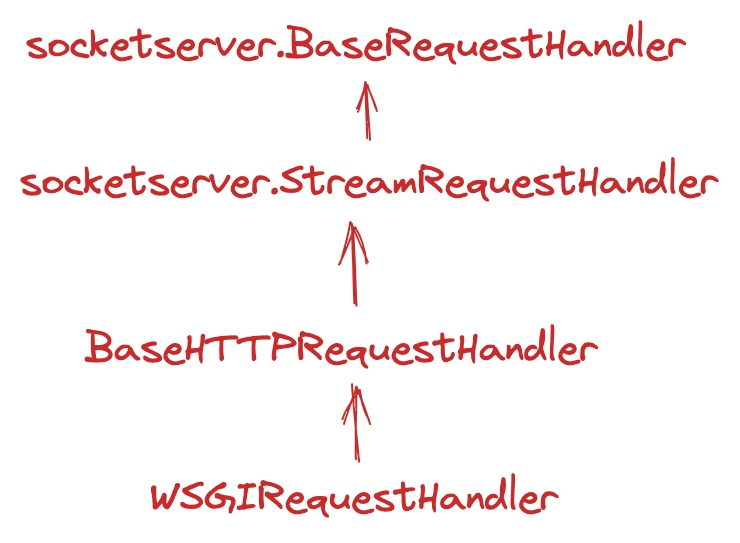

layout: post
title: "Flask   Blueprint 源码解读"
date: 2023-10-19 23:33:19 -0000
categories: BaseException, Python, Exception

layout: post
title: "BaseException vs Exception"
date: 2021-05-14 20:23:01 -0000
categories: Flask, Blueprint, source code

# Flask - Blueprint 源码解读
```python
rb = Blueprint('rbac', __name__, url_prefix='/fuxi/rbac')

@rb.route('/permission/search', methods=["GET"])
@perm_mg.tag(name='搜索权限')
def search_permission():
    schema_res = SearchPermissionSchema().load(request.args)
    if schema_res.errors:
        raise StandardError(msg=schema_res.err_text)
    query_data = PermService.search(schema_res.storage)
    return json_response(data=query_data)

app.register_blueprint(rb)
```
以上述代码为例，探寻`Blueprint`的调用关系。
## Blueprint的定义
```python
rb = Blueprint('rbac', __name__, url_prefix='/fuxi/rbac')
```
定义在此模块下的`Blueprint` rb，其中`rbac`为此蓝图的名称，`__name__`会获取当前模块的名称，例如当前模块的相对路径为：`app/rbac/view/main.py`，那么`__name__`此时就是`app.rbac.view.main`，这个会结合`view_func`实现路径到执行函数的映射。
`url_prefxi`会结合`rb.route`的第一个参数`rule`一起构成http请求的请求路径。
## rb.route函数
函数的调用路径如下图所示：


`route`函数实际是一个装饰器。
通常我们写两层层的装饰器都是这么写：
``` python
import time
import functools
from config import user_logger

def timeit(func):
    @functools.wraps(func)
    def wrapper(*args, **kwargs):
        tic = time.monotonic()
        result = func(*args, **kwargs)
        toc = time.monotonic()
        elapsed_time = toc - tic
        method_name = func.__name__
        module = func.__module__
        class_name = func.__qualname__
        user_logger.info(f'{module}.{class_name}.{method_name} {elapsed_time:0.4f} seconds.')
        return result
    return wrapper

@timeit
def calc_time():
    time.sleep(2)
```
三层的装饰器：
```
def timeit_with_limit(seconds=1):
    def timeit(func):
        @functools.wraps(func)
        def wrapper(*args, **kwargs):
            tic = time.monotonic()
            result = func(*args, **kwargs)
            toc = time.monotonic()
            elapsed_time = toc - tic
            method_name = func.__name__
            module = func.__module__
            class_name = func.__qualname__
            if elapsed_time > seconds:
                user_logger.warn(f' warning {module}.{class_name}.{method_name} {elapsed_time:0.4f} seconds.')
            return result

        return wrapper
    return timeit

@timeit_with_limit()
def calc_time():
    time.sleep(2)
```

但是，如果你不想实际执行函数呢？
可以参考`route的写法`
```
    def route(self, rule, **options):
        def decorator(f):
            endpoint = options.pop("endpoint", f.__name__)
            self.add_url_rule(rule, endpoint, f, **options)
            return f
        return decorator
```
这里只是把f作为参数传递进了`self.add_url_rule`。
为什么一定要获取到endpoint？目的是为了执行从http请求中url映射到具体的`view_func`。前面的蓝图获取到了`import_name`，结合`import_name`和`endpoint`就可以定位到具体的`view_func`。

### add_url_rule 函数
`add_url_rule`实际就干了一件事：构造lambda 函数，将其作为参数传递个`self.record`函数。
lambda 函数：
``` python
lambda s: s.add_url_rule(rule, endpoint, view_func, **options)
```

### record 函数
record 函数更简单了，只有一个函数类型的参数。
去掉源码中的注释和校验，就只调用了一个
```
    def record(self, func):
        self.deferred_functions.append(func)
```
其中，`self.deferred_functions`是一个`list`。

### 执行app.register_blueprint函数
去掉校验后的代码如下：
```
self.blueprints[blueprint.name] = blueprint # hash 标
# {'rbac': blueprint}
self._blueprint_order.append(blueprint) # 列表
# [blueprint]
first_registration = True
blueprint.register(self, options, first_registration)
```
实际是调用了`blueprint`的register函数，将`app`、`options`、`first_registration`作为参数传递进去。

``` python
def register(self, app, options, first_registration=False):
    self._got_registered_once = True
    state = self.make_setup_state(app, options, first_registration) # 构造BlueprintSetupState 实例

    if self.has_static_folder:
        state.add_url_rule(
                self.static_url_path + '/<path:filename>',
                view_func=self.send_static_file, endpoint='static'
            )

    for deferred in self.deferred_functions:
        deferred(state)
```
在上面for 循环中，defrered 实际是上面提到的lambda函数，执行lambda函数。
在lambda函数中，我们看到实际执行的是`s.add_url_rule`，这里的s对应的就是`state`，也就是`BluePrintSetupState`这个类的`add_url_rule`函数。
源码如下：
``` python
def add_url_rule(self, rule, endpoint=None, view_func=None, **options):
    # 构造完整的url path，eg: /shanhai/rbac/permission/search
    # 其中 /shanhai/rbac 表示url_prefix
    # permission/search 表示rule
    
    if self.url_prefix:
        rule = self.url_prefix + rule
    options.setdefault('subdomain', self.subdomain)
    # endpoint 如果为空，指向view_func.__name__
    if endpoint is None:
        endpoint = _endpoint_from_view_func(view_func)
    defaults = self.url_defaults
    if 'defaults' in options:
            defaults = dict(defaults, **options.pop('defaults'))
    
    # 调用app的add_url_rule 
    # 参数为rule , endpoint, view_func 
    # rule: /shanhai/rbac/permission/search
    # endpoint: '%s.%s' % (self.blueprint.name, endpoint)
    # view_func: view_func
    self.app.add_url_rule(rule, '%s.%s' % (self.blueprint.name, endpoint),
                              view_func, defaults=defaults, **options)
```
最后就是`app.add_url_rule`。
关键部分如下：
``` python
        rule = self.url_rule_class(rule, methods=methods, **options)
        rule.provide_automatic_options = provide_automatic_options

        self.url_map.add(rule)
        if view_func is not None:
            ... # 检查old_func 
            # 添加到self.view_functions，这样就可以根据endpoint 找到view_func了
            self.view_functions[endpoint] = view_func
        
```

现在结合实际的请求，来看下一个真实的请求是如何被处理的。
首先，Flask不建议使用`app.run`的方式部署在生产环境中，更合适的方式是结合WSGI server的方式部署。
这里为了简单起见，简单介绍下以`app.run`方式启动的情况下，请求被解析的过程。
调用过程：
`app.run->app.run_simple->{server=make_server()'; server.run_forever()}`
这样就启动web_service，其中run_forever是一个while 循环。

make_server默认启动 `ThreadedWSGIServer`，因此，最终也是调用了`ThreadedWSGIServer`的`run_forever()`。

`ThreadedWSGIServer` 的继承关系图如下：


在`run_forever` -> `self._handle_request_noblock`->  调用`ThreadingMixIn.process_request`
``` python
    def process_request(self, request, client_address):
        """Start a new thread to process the request."""
        # 启动一个线程，调用self.process_request_thread
        t = threading.Thread(target = self.process_request_thread, args = (request, client_address))
        t.daemon = self.daemon_threads
        if not t.daemon and self._block_on_close:
            if self._threads is None:
                self._threads = []
            self._threads.append(t)
        t.start()
```
继续看下 `self.process_request_thread`的代码：
```
    def process_request_thread(self, request, client_address):
        """Same as in BaseServer but as a thread.

        In addition, exception handling is done here.

        """
        try:
            # 还是调用 self.finish_request
            self.finish_request(request, client_address)
        except Exception:
            self.handle_error(request, client_address)
        finally:
            self.shutdown_request(request)
```
`finish_request`继承自 `BaseServer`，就是调用了`self.RequestHandlerClass`，没干别的。

`self.finish_request`-> `self.RequestHandlerClass(request, client_address, self)`

`self.RequestHandlerClass` 这个具体是什么呢？
从继承关系图中可以看到，ThreadWSGIServer继承自`BaseWSGIServer`，
在`BaseWSGIServer`的init函数中，`handler` 是第四个参数，定义了`handler`：
``` python
    def __init__(
        self,
        host: str,
        port: int,
        app: "WSGIApplication",
        handler: t.Optional[t.Type[WSGIRequestHandler]] = None,
        passthrough_errors: bool = False,
        ssl_context: t.Optional[_TSSLContextArg] = None,
        fd: t.Optional[int] = None,
    ) -> None:
        # 如果没有指定，默认为WSGIRequestHandler
        if handler is None:
            handler = WSGIRequestHandler
        .... # 中间代码省略
        # 将handler 传给了父类，BaseWSGIServer的父类为`HTTPServer`，但是，HTTPServer 没有初始化函数，HTTPServer继承 TCPServer，所以，再看下TCPServer的初始化函数定义就知道handler就是RequestHandlerClass 
        # TCPServer的初始化：
        # __init__(server_address, RequestHandlerClass, bind_and_activate=True)
        super().__init__(server_address, handler)

```
在前面提到的`run_simple`函数中，并没有指定handler，所以，`self.RequestHandlerClass` 实际就是 `WSGIRequestHandler`。


继续看 `WSGIRequestHandler`，先来看下 `WSGIRequestHandler`的继承关系图：

因为在`finish_request`中只初始化了handler，所以，重点来看下初始化函数 `__init__`做了哪些事情，在上述的继承关系中，只有基类 `BaseRequestHander`存在初始化函数，定义如下：
```
    def __init__(self, request, client_address, server):
        self.request = request # socket.socket
        self.client_address = client_address # 格式如下：('127.0.0.1', 51895)
        self.server = server # <werkzeug.serving.ThreadedWSGIServer object at 0x111269550>
        self.setup() # 处理socket 的写入和读取
        try:
            self.handle() # 重点关注这里
        finally:
            self.finish() # 这里
```
先看下`self.handle`函数，这个函数调用的就是WSGIRequestHandler自己的`handle`函数，但是在这个handle函数实际调用了通过BaseHTTPRequestHandler调用了WSGIRequestHandler的`handle_one_request`。

终于开始解析请求了，看下 `handle_one_request`的代码：
```
    def handle_one_request(self) -> None:
        """Handle a single HTTP request."""
        self.raw_requestline = self.rfile.readline() # 读取http请求的原始报文数据，例如：
        # b'GET /fuxi/rbac/permission/search HTTP/1.1\r\n'
        
        if not self.raw_requestline:
            self.close_connection = True
        # 非空，解析请求
        elif self.parse_request():
            self.run_wsgi()
```

**parse_request**就是负责解析http 请求数据。而且，不支持 `http2.0`，但是实际线上环境就是跑在http2.0协议上的，开发环境还是http1.1。（当然这个是基于python3.6.8中http/server.py的代码）
解析结束会对：
 - self.command
 - self.path
 - self.request_version 
 - self.headers 
 完成赋值。

解析header会抛出哪些异常？
 - LineTooLong("header line") 65536 字节
 - HTTPException("got more than %d headers" % _MAXHEADERS) # 最多100个header

``` python 
        # 2.0 协议实现双向通信了，而且默认就是keep-alive
         elif (conntype.lower() == 'keep-alive' and
              self.protocol_version >= "HTTP/1.1"):
            self.close_connection = False
```

请求解析完成后，进入`run_wsgi函数`，看下具体做了哪些工作？
 - 构造WSGI Environment
   WSGI Environment 详细信息可以参考 [python pep0333](https://peps.python.org/pep-0333/)
 - 调用`execute`函数，开始执行flask app 相关的代码，也就是middleware、dispatch_request、view_function 等。
``` python
        try:
            execute(self.server.app)
        except (ConnectionError, socket.timeout) as e:
            self.connection_dropped(e, environ)
        except Exception:
            if self.server.passthrough_errors:
                raise
            from .debug.tbtools import get_current_traceback
```


execute 源码：


```python
    def execute(app: "WSGIApplication") -> None:
    # app 这里就是flask.app了，但是，注意，这里app是instance，而不是class，所以，这里会直接执行flask.app的 __call__函数
    #
        application_iter = app(environ, start_response)
        try:
            for data in application_iter:
                write(data)
            if not headers_sent:
                write(b"")
        finally:
            if hasattr(application_iter, "close"):
                application_iter.close()  # type: ignore
```
继续来看`flask.app.__call__`函数
`__call__`函数只调用了 `self.wsgi_app`

`wsgi_app`函数的源码
``` python
        ctx = self.request_context(environ)
        error = None
        try:
            try:
                ctx.push() # 将请求上下文添加到`_request_ctx_stack`
                response = self.full_dispatch_request()
            except Exception as e:
                error = e
                response = self.handle_exception(e)
            except:
                error = sys.exc_info()[1]
                raise
            return response(environ, start_response)
        finally:
            if self.should_ignore_error(error):
                error = None
            ctx.auto_pop(error)
```
在flask中，requst是被存储在线程的local（在flask中被封装在LocalStack中）中的，**_request_ctx_stack**是**LocalStack**类型的全局变量，request 会被push到`_request_ctx_stack`。这样，当你直接使用`from flask import request; request.xxx`时，就能直接找到(见_look_req_object函数 flask/globals.py)。

回到，wsgi_app函数本身，处理完请求上下文之后，开始调度请求，这是通过`self.full_dispatch_request`函数完成的。
在`self.full_dispatch_request`中主要完成以下几个事情：
 - befor_first_request_functions
 - before_request_functions 
 - 执行dispatch_request
 
 befor_first_request_functions 和 before_request_functions 都是自定义middleware 添加中，所以这里不做过多的解释。
 直接看调度请求函数。
 ```
 self.view_functions[rule.endpoint](**req.view_args)
 ```
 在app.add_url_rule函数中，会把view_func添加到`self.view_functions`中，在`dispatch_request`中通过`view_functions`找到view_function，执行。
 
 接着就是 `finalize_request`函数。
 从view_func中返回结果会作为`finalize_request`的参数，接着调用`make_response`函数构造response。
 
 


