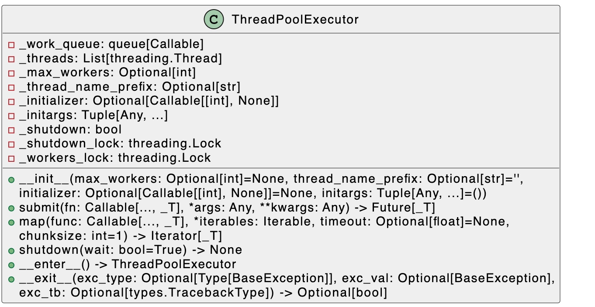

layout: post
title: "Python 线程池"
date: 2023-10-19 23:33:19 -0000

# Python 线程池
- [Python 线程池](#python线程池)
  - [如果让你设计一个线程池，你会怎么设计？会考虑哪些因素？](#如果让你设计一个线程池，你会怎么设计？会考虑哪些因素？)
  - [ThreadPoolExecutor源码解读](#threadpoolexecutor源码解读)
  - [默认的线程数设置为多少合适？](#默认的线程数设置为多少合适？)
  - [_WorkItem](#workitem)
  - [该用map 函数还是用as_complete](#该用map函数还是用-as-complete)
  - [阻塞和非阻塞](#阻塞和非阻塞)

## If you were asked to design a thread pool, how would you design it? What factors would you consider?
1. **Number of threads**: Determine the optimal number of threads in the thread pool. This is typically based on the number of available CPU cores and the nature of executing tasks (CPU-bound or I/O-bound tasks). A good rule of thumb is to set the number of threads to the number of available CPU cores for CPU-bound tasks and a higher number for I/O-bound tasks.

2. **Task queue**: Implement a task queue to hold tasks waiting to be executed by the thread pool. This can be done using a data structure like a linked list, an array, or a priority queue, depending on the desired scheduling policy (FIFO, LIFO, or priority-based).

3. **Synchronization**: Ensure proper synchronization between threads to avoid race conditions and deadlocks. This can be achieved using concurrency primitives like mutexes, semaphores, and condition variables.

4. **Thread creation and management**: Decide on a strategy for creating and managing threads, such as creating all threads at once (eager initialization) or creating them on-demand (lazy initialization). Consider using a thread factory to create and configure threads consistently.

5. **Task execution**: Determine how tasks will be executed by threads in the pool. This may involve creating a worker function that each thread runs, which retrieves tasks from the task queue and executes them.

6. **Task scheduling**: Design a task scheduling policy to determine the order in which tasks are executed. Common policies include first-in-first-out (FIFO), last-in-first-out (LIFO), or priority-based scheduling.

7. **Error handling**: Establish an error handling strategy for tasks that encounter exceptions during their execution. This may involve logging errors, retrying tasks, or propagating errors to the caller.

8. **Resource management**: Ensure proper management of resources used by the thread pool, such as memory, file handles, and network connections. This may involve implementing clean-up procedures when the thread pool is shut down or when individual threads are terminated.

9. **Scalability**: Consider the scalability of the thread pool design in terms of the number of tasks, the number of threads, and the available system resources. This may involve implementing dynamic thread pool resizing based on system load and resource availability.

10. **Monitoring and diagnostics**: Provide mechanisms for monitoring the state and performance of the thread pool, such as the number of active threads, the number of tasks in the queue, and the average task execution time. This information can be used for debugging, performance tuning, and capacity planning.


## ThreadPoolExecutor源码解读


### What is the appropriate default number of threads to set?
The default value for max_workers in ThreadPoolExecutor varies depending on the Python version.

For Python 3.5 and later, if max_workers is not specified, it defaults to min(32, os.cpu_count() + 4).

For Python 3.2 to 3.4, the default value is 5.

For Python 2, the default value is also 5.

The reason for setting the default value of max_workers to min(32, os.cpu_count() + 4) in Python 3.5 and later is to balance the need for concurrency with the need to avoid overloading the system with too many threads.


```python
def __init__(self, max_workers=None, thread_name_prefix='',
                 initializer=None, initargs=()):
                 
    if max_workers is None:
        max_workers = min(32, (os.cpu_count() or 1) + 4)
    self._max_workers = max_workers
    self._work_queue = queue.SimpleQueue()
    self._idle_semaphore = threading.Semaphore(0)
    self._threads = set()
    self._broken = False
    self._shutdown = False
    self._shutdown_lock = threading.Lock()
    self._thread_name_prefix = (thread_name_prefix or
                                        ("ThreadPoolExecutor-%d" % self._counter()))
    self._initializer = initializer
    self._initargs = initargs
```
### Task queue

**如何得知当前线程池里面是否有空闲线程？如何避免空闲线程竞争？**
在初始化中，定义了一个信号量

```
self._idle_semaphore = threading.Semaphore(0)
```

线程池实现的方式类似懒加载的方式，当有新的任务需要被处理时，先检查是否有空闲的线程（通过信号量`self._idle_semaphore.acquire(timeout=0)`），如果不存在，就创建新的线程处理任务。

**信号量的值被初始化为0，怎么实现是否有空闲线程的？**
每次调用 `pool.submit`函数时，会调用 `_adjust_thread_count`。如果有空闲线程，直接返回，如果没有，创建新的线程。

```
    def _adjust_thread_count(self):
        # if idle threads are available, don't spin new threads
        # 非阻塞的方式检查是否有空闲的线程
        if self._idle_semaphore.acquire(timeout=0):
            return

        # When the executor gets lost, the weakref callback will wake up
        # the worker threads.
        # 当executer释放之后，会通过queue 优雅的退出管理的线程
        # weakref_cb只有在 
         > If callback is provided and not None, and the returned weakref object is still alive, 
         > the callback will be called when the object is about to be finalized; 
         > the weak reference object will be passed as the only parameter to the callback; the referent will no longer be available.
        def weakref_cb(_, q=self._work_queue):
            q.put(None)

        num_threads = len(self._threads)
        if num_threads < self._max_workers:
            thread_name = '%s_%d' % (self._thread_name_prefix or self,
                                     num_threads)
            t = threading.Thread(name=thread_name, target=_worker,
                                 args=(weakref.ref(self, weakref_cb), # 弱引用
                                       self._work_queue,
                                       self._initializer,
                                       self._initargs))
            t.daemon = True
            t.start()
            self._threads.add(t)
            _threads_queues[t] = self._work_queue # 将线程添加到全局的字典中
```

每次处理完任务后，会调用信号量的释放操作，信号量的释放操作，对应的`_value`会加1。
信号量的大小表示当前被实际占用的线程数量。
self._threads 表示实际生成的线程的集合，通过计算 就可以得出当前空闲的线程数量。

```
        while True:
            work_item = work_queue.get(block=True) # 如果没有任务，就会一直block在这
            if work_item is not None:
                work_item.run()
                # Delete references to object. See issue16284
                del work_item

                # attempt to increment idle count
                executor = executor_reference() # 弱引用
                if executor is not None:
                    executor._idle_semaphore.release()
                del executor
                continue
```

**线程池中的线程存在哪里的？**

```python
self._threads = set()
```
另外，因为 worker threads 是 daemon thread，当线程池中存在空闲线程时，允许 解释器退出。但是，直接让线程跟随解释器退出，不够优雅，例如文件写到一半中断了等等。
所以，线程池创建线程时，会把 线程 存储到全局的 `_threads_queues`。
然后通过 `atexit.register` 函数注册解释器退出时的callback 函数 `_python_exit`。
下面的代码版本为3.6.8，存在线程安全隐患。
在3.9 版本中引入了global_shut_down的锁。

``` python
def _python_exit():
    global _shutdown
    _shutdown = True
    items = list(_threads_queues.items())
    for t, q in items: # 给每个线程放一个None
        q.put(None)
    for t, q in items: # 等待每个线程退出
        t.join()

atexit.register(_python_exit)

```

问题：如果解释器 没退出，线程池 释放了，`_threads_queues` 中关联的线程是如何释放的？

这就利用了 `weakref.WeakKeyDictionary()`。
如果`key`释放了，对应的条目会从dict中删除。

**线程池待处理的任务是存在哪的？如何避免竞争的？**

通过queue存储，并且通过queue避免竞争

```python
self._work_queue = queue.SimpleQueue()
```

**线程的名字？**
``` python
self._thread_name_prefix = (thread_name_prefix or
                                    ("ThreadPoolExecutor-%d" % self._counter()))

num_threads = len(self._threads) # set()
thread_name = '%s_%d' % (self._thread_name_prefix or self,
                                     num_threads)
```

**任务怎么添加到任务队列（`self._work_queue `）中的？**
通过submit函数
```
def submit(*args, **kwargs):
```
参数一般是执行函数和执行函数所需要的参数
返回值是一个Future对象
例如：
```python
future = pool.submit(step_cell, *args)
```

**future 存储到了哪里？**
future 对象被装进WorkItem，扔进了`self._queue`中，等待线程从`self._queue`中拿出来进行处理。

**以下代码会不会立即退出？**
```
def target(value):
    user_logger.info(value)
    time.sleep(12)
    print(19)

pool = ThreadPoolExecutor()
for i in range(10):
    pool.submit(target, i)
print('main thread come here')
```
答案是不会，虽然主线程的逻辑已经执行完，但是pool的每个线程都是非`dameon`的，所以target会执行完才会退出。
如果在web中，上述写法会不会导致pool 一直不释放？
不会，因为pool的释放，会执行弱引用的callback，在队列中添加None，实现优雅的退出。

**如何保证安全退出的**
```
    def shutdown(self, wait=True):
        with self._shutdown_lock:
            self._shutdown = True
            self._work_queue.put(None)
        if wait:
            for t in self._threads:
                t.join()
```
当需要退出时，先获取`_shutdown_lock`，将pool的_shutdown变更为True，同时在队列中添加一个None，同时把线程join进来，等待线程池中的所有线程执行完。
首先拿到None的线程，会继续添加None到队列中，直到所有线程都退出（细节见 `_worker`函数）。

## _WorkItem
队列中元素类型就是workitem，workitem有四个参数：
- future
- fn
- args
- kwargs
fn 就是线程要执行的任务，args 和 kwargs是其参数
future 是最终返回的结果，future 会通过set_result把fun的结果放到future中。
源码：
```
class _WorkItem(object):
    def __init__(self, future, fn, args, kwargs):
        self.future = future # Future 对象
        self.fn = fn 
        self.args = args
        self.kwargs = kwargs

    def run(self):
        if not self.future.set_running_or_notify_cancel():
            return

        try:
            result = self.fn(*self.args, **self.kwargs)
        except BaseException as exc:
            self.future.set_exception(exc)
            # Break a reference cycle with the exception 'exc'
            self = None
        else:
            self.future.set_result(result)
```
对于生产workitem的地方在submit函数中：
```
    def submit(self, fn, *args, **kwargs):
        with self._shutdown_lock:
            if self._shutdown: # 判断是否shutdown
                raise RuntimeError('cannot schedule new futures after shutdown')

            f = _base.Future() # new 一个Future对象
            w = _WorkItem(f, fn, args, kwargs) # 构造workitem

            self._work_queue.put(w) # 入线程安全队列
            self._adjust_thread_count() # 调整线程的数量
            return f
```

`self._work_queue`会作为参数传递给`_worker`函数，具体代码在`_adjust_thread_count`函数中：

```
t = threading.Thread(name=thread_name, target=_worker,
                                 args=(weakref.ref(self, weakref_cb),self._work_queue))
t.daemon = True #作为守护线程存在，不会执行完就退出
t.start() # 启动线程
```
从上面的代码可以看到：
线程的执行是在`_worker`中完成，`_worker`会从队列中获取workitem，`workitem`会执行`fun`函数，然后将结果放到future中。
这样，因为我们主要使用的是`submit`函数，`submit`函数返回的是一个Future函数，如果全部执行完，就能通过Future拿到所有的结果。

## 该用map 函数还是用as_complete
map的主要是保证执行顺序，按照进入map的顺序执行
as_complete 不保证顺序
从某些场景下，例如有比较耗时的任务排在前面，耗时较短的任务排在后面，as_complete的执行效率更高。

## 阻塞和非阻塞
如果调用了pool的`shutdown`，就会 **block**，直到所有任务都执行结束。
如果不调用pool的`shutdown`，也不使用上下文用法，因为pool的每个线程都是`dameon`模式工作的，所以也会执行完成才退出。pool执行完所有任务后，会被gc回收，这样连带pool中所有的线程也会退出。
实现的细节在：shutdown函数，_worker函数

验证：
``` python
    def target(value):
        user_logger.info(value)
        time.sleep(12)
        print(12)
    address = None

    pool = ThreadPoolExecutorEx()
    
    def process():
        task = pool.submit(target, 12)
        task1 = pool.submit(target, 12)
        task2 = pool.submit(target, 12)
        global address
        address = id(pool)
    process()
    print('come here')
    # time.sleep(100) # 不注释这句话，打印出来的线程数为1，注释的话，打印出的线程数为6（为啥是6？我也不清楚）
    print(threading.active_count())
    print(ctypes.cast(address, ctypes.py_object).value)
```

## 为什么在新版本的`Lib/concurrent/futures/thread.py`中使用了`Semaphore` ？
具体，你可以通过 页面 `https://github.com/python/cpython/blame/main/Lib/concurrent/futures/thread.py` 右上角的**blame** 按钮，点击之后，可以看到每一行代码的注释信息。
关于`Semaphore`的注释可以通过对应的feature 或者 issue 找到具体变更的原因。

> The change fixes an issue where ThreadPoolExecutor doesn't check if existing threads are idle before spinning up new ones. To do this, we use a simple counter within the Executor to track how many threads are idle, and atomically increment and decrement the count as needed.

> One question - the previous code to spin up a new thread in _adjust_thread_count does not appear thread safe - if two threads are both submitting items to the executor at the same time, the call to check the number of threads could be invalid. Is this something that should also be fixed, or is this not an issue because of the global interpreter lock?