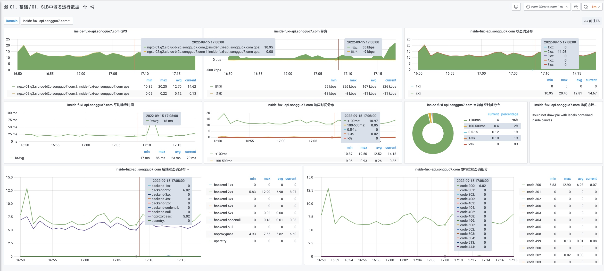

layout: post
title: "API接口性能调优"
date: 2023-10-19 23:33:19 -0000
categories: BaseException, Python, Exception

layout: post
title: "API接口性能调优"
date: 2022-03-04 23:23:01 -0000
categories: performance, api

- [API接口性能调优](#api接口性能调优)
  - [1. 索引](#1索引)
  - [2. sql 优化](#2-sql优化)
  - [3. IO请求](#3-io请求)
    - [串行-> 并行](#串行并行)
    - [异构](#异构)
  - [4. 重复调用](#4重复调用)
  - [5. 异步](#5异步)
  - [6. 避免大事务/批量处理](#6避免大事务批量处理)
  - [7. 锁的优化](#7锁的优化)
  - [8. 加缓存](#8加缓存)
  - [9. service 水平扩展](#9-service水平扩展)
  - [10. 分库分表](#10分库分表)
  - [11. 加监控](#11加监控)
  - [12. 数据压缩](#12数据压缩)
排查的步骤：
- 使用指标进行排查 -> 请求数、错误、延迟、请求和响应大小
指标会针对应用和位置提供精细的维度信息。
开发者可以发现异常的 API 使用情况，并确定潜在的根本原因。例如，错误代码高于 400 可能表示最近更新的应用遇到了一些逻辑错误，而较高的请求和响应大小可能会导致应用性能降低。
- 使用日志进行问题排查
    - 比起指标信息，日志通常包含更多错误信息，例如错误消息和错误详情。这些信息十分有用，对于排查 API 错误必不可少。如果开发者发现有关 API 使用的任何问题，可以查询日志以查找错误消息和错误详情，并使用这些信息来解决错误或与支持团队联系。
解决错误
 - 一般来说，每个 API 错误都包含 3 项信息：错误代码、错误消息和错误详情：

 - 通过错误代码，应用可以处理更高级别的错误，例如，在处理 503 错误后重试，或在处理 401 错误后重新验证用户的身份。
通过错误消息，应用开发者可以理解错误并修复应用逻辑。

# API接口性能调优
需要根据不同的场景做不同的优化，以下优化的手段不仅仅适用于API，同样适用于其他业务代码。优化的基本思路都是一致的。
step1: 定位耗时较长的代码。
step2: 确定耗时较长的代码属于哪一种场景，然后具体场景，具体优化。

按照耗时场景可以有以下几个方面：
## 1. 索引
现象：sql语句耗时长
可以分成三种情况：
 - 没加索引
 - 索引没生效
 - 选错索引
## 2. sql 优化
 - 主动优化
 - 被动优化
## 分页优化
 - 设计上 - 滑动方式代替count 方式，或者返回一个假的的count数据
 - 逻辑上优化 - 用id 代替offset

## 3. IO请求
### 串行-> 并行
多线程/协程
### 异构
 A信息/B信息/C信息-> 汇总成一条信息存储到Redis 或者 其它存储中
## 4. 重复调用
 递归访问，比较常见是处理树结构相关的数据。例如，多级菜单，组织架构等
 方法：1. 调整树结构的存储形式，可以采用nest set model 方式存储，或者将整颗树存储

## 5. 异步
针对通知、生成报告、生成操作记录等，可以将这些动作通过多线程 或者消息队列的方式异步完成。
## 6. 避免大事务/批量处理
大事务会导致其它API锁等待
针对for loop 插入 或者更新，可以批量插入 或者更新，根据业务做调整
## 7. 锁的优化
悲观锁比较常见，而且业务中用的也比较多。
锁的颗粒度：全局锁、表锁、行锁、gap 锁。
选择颗粒度较小的锁。
尽量用乐观锁替换悲观锁。

## 8. 加缓存
数据对实时性要求没有那么高的场景下，可以通过缓存策略提高api响应速度。
## 9. service 水平扩展
## 10. 分库分表
最后一招，分库分表，
## 11. 加监控

## 12. 数据压缩
对http 请求进行数据压缩