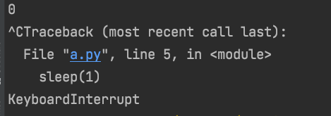

layout: post
title: "BaseException vs Exception"
date: 2022-04-10 20:23:01 -0000
categories: BaseException, Python, Exception

# BaseException vs Exception
## 为什么关注这个问题？
在做code review中，发现好几个同学的代码对异常的处理都是类似这种结构：
try:
    ...
except BaseException as e:
    ...

我觉得有必要解释下BaseException 和 Exception的区别。
## pep 352 Required Superclass for Exceptions

在 Python 2.4以前（包含Python2.4），任何 (经典) 类都可以作为一个异常被引发。2.5的计划是允许新式的类，但这会导致使得问题变得更糟，因为这意味着任何类 (或实例) 都可以作为异常被触发！**这是个问题，因为它阻止了对异常接口的任何保证。**本PEP建议引入一个新的超类，所有被引发的对象都必须继承自这个超类。**强制的限制将允许存在一个可以依赖的标准的异常接口**。这也导致了所有的异常都要遵守一个已知的继承结构。
所有的异常都继承自Except有什么问题？
在PEP352中给出了解释：

> This is a problem since this includes two exceptions (KeyboardInterrupt and SystemExit) that often need to be excepted from the application's exception handling: the default behavior of shutting the interpreter down without a traceback is usually more desirable than whatever the application might do (with the possible exception of applications that emulate Python's interactive command loop with >>> prompt). Changing it so that these two exceptions inherit from the common superclass instead of Exception will make it easy for people to write except clauses that are not overreaching and not catch exceptions that should propagate up.

这段话的意思是，像KeyboardInterrupt 和 SystemExist，这种异常不应该被应用程序捕获，缺省行为应该是直接关闭解释器。
因此，需要提供一个通用的超类。在PEP352中引入了一个新的类 `BaseException`，继承关系如下：

从BaseException 派生出来的异常有：
- BaseException
  |- KeyboardInterrupt
  |- SystemExit
  |- Exception
     |- (all other current built-in exceptions)

这样做使得捕捉异常更加合理。它将只捕捉标志着错误的异常。标志着解释器应该退出的异常将不会被捕获，从而被允许向上传播并允许解释器终止。

键盘中断（KeyboardInterrupt）也直接继承BaseException，因为用户通常希望当他们按下中断键（通常是Ctrl-C）时，应用程序会退出。如果你用`try ... except: `，那么预期的行为就不会发生。
例如：
```
from time import sleep 
if __name__ == '__main__': 
    try: 
        for i in range(10000): 
            sleep(1) 
            print(i) 
    except: 
        print('enter here') 
    print('continue doing') 
```
当按下CTRL-C后，except 会捕获该异常，并且会继续执行。


修改代码如下：

```
from time import sleep
if __name__ == '__main__':
    try:
        for i in range(10000):
            sleep(1)
            print(i)
    except Exception as e:
        print('enter here e!r')
    print('continue doing')
```
按下CTRL-C后，except无法捕获到KeyBoardInterrupt异常，所以解释器直接退出了。



由于类似的原因，SystemExit 也直接继承BaseException。因为当sys.exit()被调用时，异常被引发，解释器通常应该被允许终止。如果你用`try ... except: `，那么预期的行为也不会发生。

强烈建议在开发过程中使用Exception。基于键盘中断（KeyboardInterrupt）和系统中断（SystemExit）几乎总是被允许向上传播异常，不鼓励 `try ... except:` 语句或直接捕获BaseException。

参考文档：https://www.python.org/dev/peps/pep-0352/