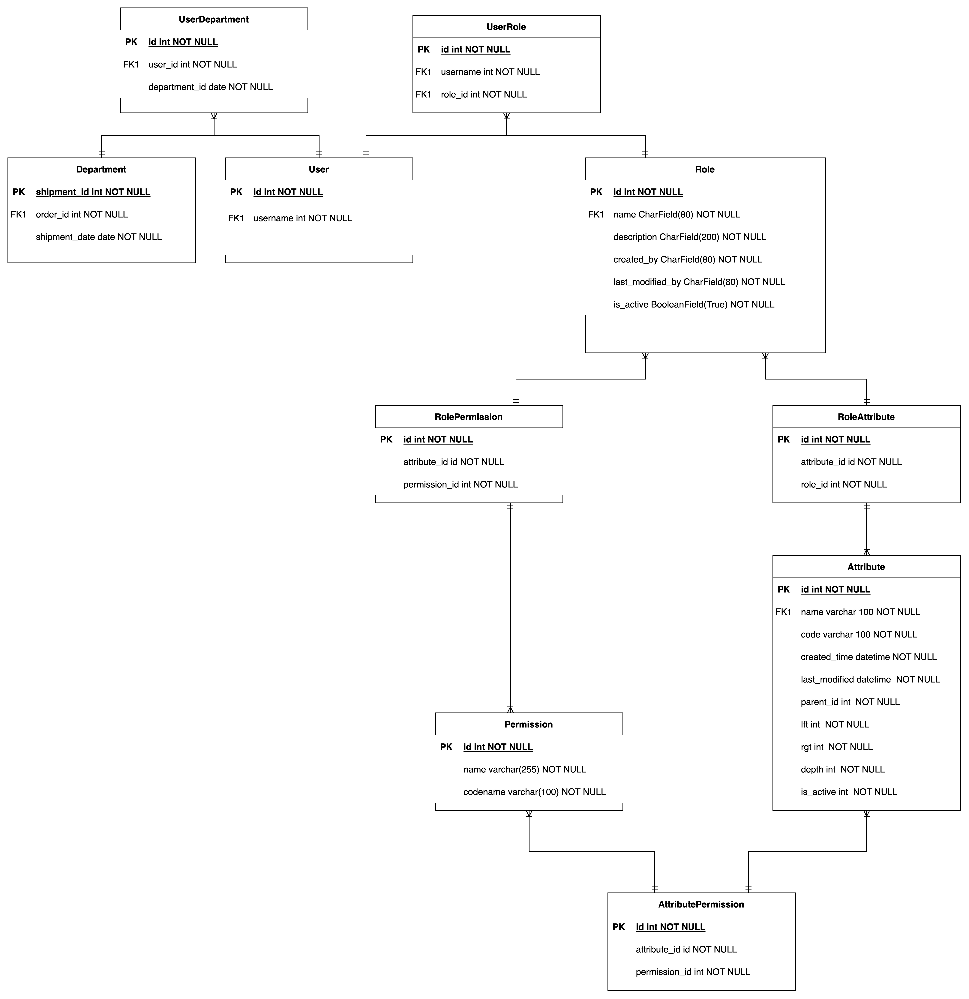

# 为SAAS应用设计权限
在进行相应的设计前，你应该了解常见的数据访问模型。
## 了解访问控制
有几种逻辑访问控制模式：强制的（Mandatory）、酌情的（Discretionary）、基于角色的（Role-based）、基于属性的（Attribute-based），等等。选择和部署访问控制模式的过程对每个组织来说都是不同的。这种选择取决于：
- 受保护数据的性质
- IT要求和工业标准
- 员工的数量
- 网络安全预算
				 
## 常见模型
### MAC  (Mandatory Access Control )
强制性访问控制（MAC）是一种访问控制模式，操作系统根据数据保密性和用户许可级别为用户提供访问权限。在这种模式下，访问权是在需要知道的基础上授予的：用户在获得访问权之前必须证明对信息的需求。
MAC被认为是所有访问控制模式中最安全的一种。访问规则由系统管理员手动定义，并由操作系统或安全内核严格执行。普通用户不能改变安全属性，即使是他们创建的数据。
#### 通过MAC，获得访问权的过程
- 管理员配置访问策略并定义安全属性：保密级别、访问不同项目和资源类型的许可。
- 管理员给每个主体（访问数据的用户或资源）和对象（文件、数据库、端口等）分配一组属性。
- 当一个主体试图访问一个对象时，操作系统会检查该主体的安全属性，并决定是否可以允许访问。
#### MAC的优点
高水平的数据保护 - 管理员定义对对象的访问，用户不能编辑该访问。
粒度大 - 管理员手动设置用户访问权限和对象访问参数。
不受木马攻击的影响 - 用户不能解密数据或分享对机密数据的访问。
#### MAC 的缺点
可维护性 - 手动配置安全级别和许可需要管理员持续关注。
可扩展性 - MAC不能自动扩展。
对用户不友好 - 用户必须请求访问每一个新数据；他们不能为自己的数据配置访问参数。
### DAC (Discretionary Access Control)
酌情访问控制（DAC）是一种基于身份的访问控制模式，为用户提供对其数据的一定程度的控制。数据所有者（或任何被授权控制数据的用户）可以为特定用户或用户组定义访问权限。
每个数据的访问权限都存储在一个访问控制列表（ACL）中。这个列表可以在用户授予某人访问权时自动生成，也可以由管理员创建。一个ACL包括可能访问数据的用户和组以及他们可能拥有的访问级别。ACL也可以由系统管理员强制执行。在这种情况下，ACL就像一个安全策略，普通用户不能编辑或推翻它。

#### 在DAC模型中获得访问权的过程：
- 用户1创建了一个文件并成为其所有者，或获得了对现有文件的访问权。
- 用户2要求访问该文件。
- 用户1根据自己的判断授予访问权。然而，用户1不能授予超过他们自己的访问权限。例如，如果用户1只能阅读一个文件，他们不能允许用户2编辑它。
- 如果管理员创建的ACL和用户1的决定之间没有矛盾，就会授予访问权。
#### DAC 优点
- 用户友好 - 用户可以管理自己的数据并快速访问其他用户的数据。
- 灵活 - 用户可以配置数据访问参数，无需管理员。
- 易于维护 - 添加新的对象和用户不需要管理员花太多时间。
- 细致 - 用户可以为每一个数据配置访问参数。
#### DAC 缺点
- 数据保护水平低 - DAC不能确保可靠的安全，因为用户可以随意分享他们的数据

### RBAC (Role-based Access Control)
基于角色的访问控制（RBAC）是一种基于定义员工角色和组织内相应权限的访问控制方法。这种模式的理念是，每个员工都被分配了一个角色。每个角色都有一系列的权限和限制。只有当员工在系统中的角色具有相关权限时，他们才能访问对象和执行操作。
例如，一个公司的会计应该被允许处理财务信息，但不应该访问客户联系信息或信用卡数据。
一个用户可能被分配到一个或几个角色。当一个新员工来到你的公司，很容易给他们分配一个角色。而当有人离开公司时，你不需要改变角色参数或中央政策。
基于角色的访问控制方法的主要组成部分：
- 用户--对系统有访问权的个人（有UID）。
- 角色--一个命名的工作职能（表示权力的级别
- 权限 - 相当于访问权
- 会话--一个用户和一组角色之间的映射，用户在工作时间内被分配到这些角色上。
- 对象 - 一个需要访问权限的系统资源
- 操作 - 受保护网络中的任何行动
根据[NIST RBAC模型]，RBAC可以在四个层次上实现。每个后续级别都包括前一个级别的属
#### Flat RBAC
Flat RBAC是对RBAC模型基本功能的实现。
所有的用户和权限都被分配了角色，用户通过获得这些角色来获得他们需要的权限，公司需要多少角色和权限就有多少，一个用户可以被分配到多个角色，而一个角色可以被分配到多个用户。

#### Hierarchical RBAC
顾名思义，在角色结构中实现了一个层次结构。这个层次结构建立了角色之间的关系。拥有高级角色的用户获得所有初级角色的权限，这些权限被分配给他们的下级。层次结构的复杂性由公司的需求来决定。
(img)

#### Constrained RBAC

受约束的RBAC为安全系统增加了职责分离（SOD）。SOD是一个著名的安全实践，当一个单一的职责被分散到几个员工中时。这对中型企业和大型企业来说相当重要。职责分离保证了没有任何工作可以对你的系统引入欺诈性的改变，而其他人无法审计和/或修复。
(img)

#### Symmetric RBAC
对称式RBAC支持权限-角色审查以及用户-角色审查。它允许识别分配给现有角色的权限（反之亦然）。例如，通过识别一个被解雇的员工的权限，管理员可以撤销该员工的权限，然后将该角色重新分配给具有相同或不同权限的另一个用户。

#### RBAC的优点和缺点
RBAC是限制访问的最流行的方法。这种模式的主要优点是，公司不再需要以个人为单位授权或撤销访问，而是根据用户的角色把他们聚集在一起。在一个小型或中型公司建立一套角色并不具有挑战性。另一方面，在一个大型企业建立这样的系统也不是一件容易的事。
RBAC模型有几个限制。在用户开始工作之前，你不能使用系统未知的参数来设置规则。权限只能分配给用户角色，不能分配给对象和操作。另外，使用RBAC，你可以限制对系统中某些操作的访问，但不能限制对某些数据的访问。
### ABAC (Attribute-based Access Control)
基于属性的访问控制是一个从RBAC发展而来的模型。这个模型是基于为你系统的任何元素建立一套属性。一个中央政策定义了执行任何行动需要哪些用户和对象属性的组合。
让我们考虑一下根据NIST的ABAC模型的主要组成部分。
- 属性--网络中任何元素的一个特征。一个属性可以定义。
- 用户特征--雇员职位、部门、IP地址、许可级别等。
- 对象特征 - 类型、创建者、敏感性、所需的许可级别等。
- 行动类型--读、写、编辑、复制、粘贴等。
- 环境特征--时间、星期几、地点等。
- 主体 - 任何可以在网络中执行动作的用户或资源；主体被分配了属性，以定义其许可级别
- 对象 - 存储在网络中的任何数据；对象被赋予属性，以便描述和识别它们
- 操作 - 任何主体在网络中采取的任何行动
- 策略 - 一组允许或限制信息检索系统中任何行动的规则；规则是基于任何元素（用户、资源、环境）的属性的 "IF/THEN "语句

这种方法适用于任何规模的公司，但大多用于大型组织。在部署和配置阶段，ABAC比RBAC需要更多时间和精力，因为安全管理员需要定义系统的所有属性。起初，你需要手动给每个系统组件分配属性。

但是，一旦你为公司中大多数常见的工作岗位和资源创建了策略，你就可以简单地为每个新的用户和资源复制它们。这类似于RBAC模型中角色的工作方式，但在ABAC模型中，属性可以根据特定用户的需要进行修改，而无需创建新的角色。属性使ABAC成为比RBAC更精细的访问控制模型。

#### ABAC的优点和缺点
ABAC的关键好处是，它不是根据用户角色而是根据每个系统组件的属性来授予访问权。这样一来，你可以描述任何复杂的业务规则。即使你需要让某些数据只能在工作时间访问，也可以通过一个简单的策略轻松完成。除此之外，ABAC规则可以评估尚未被授权系统清查的主体和资源的属性。
 至于ABAC的局限性，由于必须**指定和维护政策的方式**，这种类型的系统**很难配置**。很难进行事前审计并确定特定用户的可用权限。它可能无法确定任何特定员工职位的风险暴露。
### Combining RBAC and ABAC
公司往往从实施扁平化的RBAC开始。这种模式更容易设置和维护。随着组织的发展和管理更多敏感数据，他们意识到需要一个更复杂的访问控制系统。RBAC和ABAC可以一起使用，RBAC做粗略的工作，ABAC用更精细的过滤来补充它。
这种访问模式也被称为**RBAC-A**。有三种RBAC-A方法来处理角色和属性之间的关系。
- 以属性为中心。一个角色成为用户属性之一的名称。它类似于一个工作头衔。在这样的模型中，"角色 "属性被用来标记某个职位所需的一组属性。
- 以角色为中心。添加属性是为了约束角色。在这样一个模型中，属性可以减少用户的可用权限。这种方法加强了你的数据的安全性。
- 动态角色。诸如一天中的时间等属性被用来确定主体的角色。在某些情况下，一个用户的角色可以完全由动态属性决定。

**权限表结构**

attribute 表对应`Entity`信息，可以是一个页面的元素，也可以是其它的属性。

关于规则如何实现：
https://www.researchgate.net/publication/4247747_Active_Authorization_Rules_for_Enforcing_Role-Based_Access_Control_and_its_Extensions
可以参考kubernetes 的实现
https://kubernetes.io/zh/docs/reference/access-authn-authz/rbac/
https://martinfowler.com/bliki/RulesEngine.html

后端功能：
1. 权限列表/添加权限/删除权限/修改权限
2. 角色列表/添加角色/删除角色/修改角色/将用户分配给角色/将用户移除角色/将权限分配给角色/将权限移除角色/将属性添加角色/将属性移除角色/复制角色
3. 资源列表/添加资源/删除资源/修改资源/将权限绑定到资源/将权限移除资源/复制属性
4. 用户鉴权系统升级
5. 将现有权限迁移到新的权限管理中
前端：
1. 权限支撑，根据权限显示用户能够看到的内容
2. 权限列表页面
3. 角色列表页面
4. 属性列表页面

后序可以扩展的地方：将角色归属到命名空间
规则
## 引用
[https://www.ekransystem.com/en/blog/mac-vs-dac]
[https://www.ekransystem.com/en/blog/rbac-vs-abac]
[https://tech.youzan.com/sam/]
