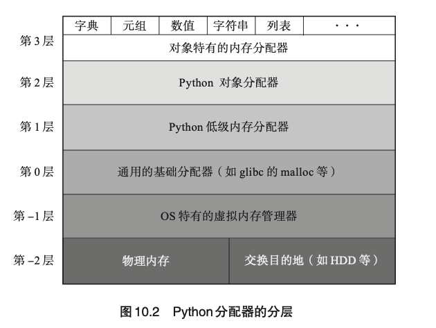
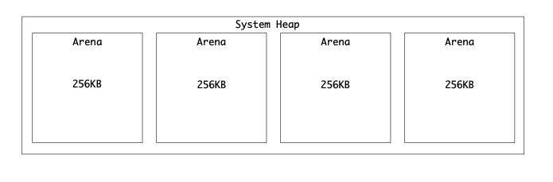
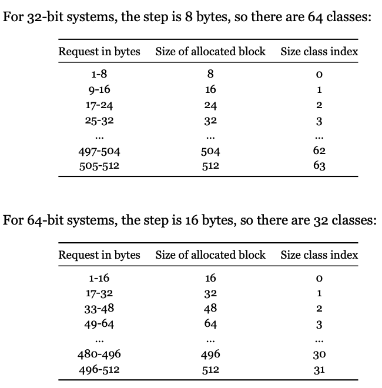
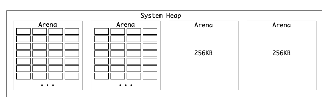
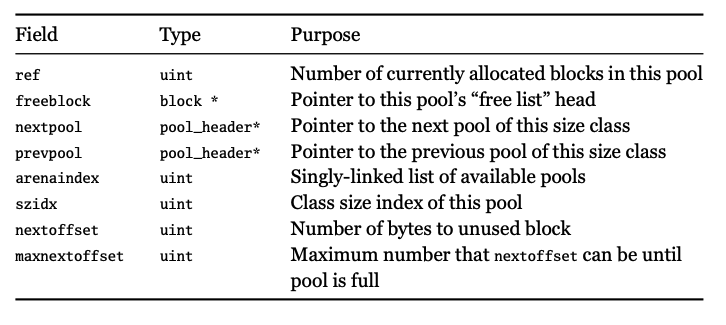
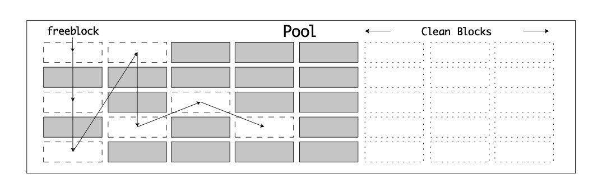
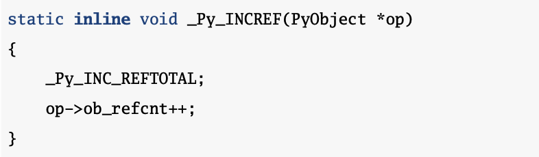

# Python内存管理
内存管理包含分配和回收两部分。
## python 内存分配器
python 是基于C语言实现的，在C语言中有三种内存分配策略：
 - 1. static memory allocation - 编译时
 - 2. Automatic memory allocation - 栈空间
 - 3. Dynamic memory allocation - 堆空间
 
CPython主要是通过第三种方式实现内存管理。在Python中，当要分配内存空间时，不单纯使用 malloc/free，而是在其基础上有三个独立的分层。
Python 低级内存分配器 - Raw Domain，从系统的堆上分配内存，用于比较大的、非对象相关的内存分配。**使用malloc 函数**
Python 对象分配器 - Object Domain 用于所有的Python 对象相关的内存分配。**使用pymalloc函数**
对象特有的内存分配器 - PyMem Domain，类似PYMEM_DOMAIN_OBJ，exists for legacy API purposes。**使用pymalloc函数**
> 注意：
>> debug环境下（编译CPython 时带着参数 `--with-pydebug`），使用的是debug版本的函数。

## 内存分配算法
内存分配的特征：
- 绝大多数的内存分配请求都比较小，并且是固定大小的。因为PyObject 16个字节，PyASCIIObject 是42个字节，PyCompactUnicodeObject是72个字节，PyLongObject是32个字节。
- pymalloc函数只负责分配内存块的大小小于256kb的，大于256kb的都交给`malloc`函数
- pymalloc 函数使用GIL而不是系统线程安全检查
### blocks，pools，Arenas
#### arenas
arenas 256kb，使用`mmap()`

**数据结构**
arenas 通过 `nextarena` 和 `prevarena`构成双向链表


#### Pools
pool的大小为4kb，所以在Arena中有64个pool。
每个pool中block的大小是固定的，但是不同的pool中包含的block的大小可能不同，因为按照32位系统来说，block的大小被设计成了64种，如下图所示：

这样一来也就有64种pool。但是，对于64位系统，步长是16，所以，block的种类为32种，pool的种类也就只有32种。



Pool 有三个状态：
Full - pool中所有可用blocks都已经被分配出去了
Used - pool已经被分配，但是，有部分block被占用，仍然还有空间
Empty - pool被分配，但是没有block被占用

Pools的数据结构：`poolp`，pool_header类型，pool_header的数据结构如下：
同一种类的pool通过`nextpool` 和 `prevpool`构成了双向链表。

arena中所有的pool构成了pool table
包含了`used_pools` 和 `free_pools`数组，每一种类型的pool通过下标确定。
 - 当一个pool变成full状态，会从`used_pools[i]`中移除
 - 如果一个处于full的pool中有block可用，该pool会被放回到`used_pools[i]`中，并且会被放到双向链表的头部。
 - 如果一个pool变成empty状态，该pool会从`used_pools[i]`中移除，并且添加到`arena`的单向链表`freepools`中。
 
 #### blocks
 在**pool**中，内存是被分配给**blocks**的。**block**的特征：
 - 在pool中，block的大小是一致的，并且分配/释放的单元也是block。
 - `freeblock`是一个单向链表，代表可用的block。
 - 当一个**block**被释放，首先被添加到 `freeblock`的头部。
 - 当pool被初始化后，只有两个block会被初始化，并且被链接到`freeblock`。
 - 只要`pool`处于`used`状态，这个pool中至少有一个`block`是可用的。


## 内存回收
为了实现简单的内存管理，python采用了两种策略来管理已经分配的内存。
 - 引用计数
 - 垃圾回收

### 引用计数
每一个`PyObject`实例都有一个属性`ob_refcnt`，这个属性表示引用到这个对象的数量。

在CPython中，引用是通过`Py_INCREF` 和 `Py_DECREF` 函数来管理的。
**增加引用**
调用`Py_INCREF`函数的场景可以分为以下几类：
 - assigned to a variable name
 - referenced as a functuon or method argument
 - returned, or yielded from a function



**减少引用**
当一个变量从它被声明的空间中释放时，该对象的引用数量减1。scope in Python can refer to a function，method，comprehension or a lambda.
`Py_DECREF`要比`Py_INCREF`复杂，因为当引用数量降为0后，还要处理释放该对象占用的空间。
```
static inline void _Py_DECREF( 
#ifdef Py_REF_DEBUG
    const char *filename, int lineno, 
#endif
    PyObject *op)
{
    _Py_DEC_REFTOTAL;
if (--op->ob_refcnt != 0) { 
#ifdef Py_REF_DEBUG
    if (op->ob_refcnt < 0) { 
        _Py_NegativeRefcount(filename, lineno, op);
    }
#endif
    }
    else { # 等于0了，要释放内存
        _Py_Dealloc(op);
    }
}
````
引用计数的优点：简单，快速，高效。
缺点：循环引用，自己引用自己。
```
x = []
x.append(x)
del x
```
the reference count for x is still 1 because it referred to itself.

### 垃圾回收
Python的垃圾回收算法采用的是`分代垃圾回收算法 Generational GC`，`Generational GC`依赖的是:
> most(80%) objects are destroyed shortly after being created.
Cpython 的GC 的`Generational GC`分为青年、中年、老年三代。
只有在到达阀值时才会触发垃圾回收。阀值可以通过以下方式获取：
```
gc.get_threshold() 
(700, 10, 10)
```
当某一个代到达阀值时，会触发垃圾回收，在垃圾回收时会把上一个代的数据合并检查，在垃圾回收中存活下来的变量会被添加到下一代。


当你用完某样东西后，你会把它丢掉，然后扔进垃圾桶。但是这些垃圾不会被直接收集起来。你需要等待垃圾车来收集它。
CPython也有同样的原理，使用垃圾收集算法。CPython的垃圾收集器默认是启用的，在后台进行，并致力于重新分配已经不存在的objects的内存。

因为垃圾收集算法比参考计数器复杂得多，所以不会一直发生。如果发生了，就会消耗大量的CPU资源。垃圾收集会在设定的操作次数后周期性地运行。

一些GC算法，比如mark-and-sweep, or stop-and-copy ，都是从系统的根部开始，探索所有可到达的对象。这在CPython中很难做到，因为C扩展模块可以定义和存储自己的对象。你不能简单地通过查看locals()和globals()来确定所有对象。
对于长期运行的进程，或者大型数据处理任务，内存耗尽会造成很大的问题。
取而代之的是，CPython垃圾回收器利用现有的引用计数器和自定义的垃圾回收算法来寻找所有无法到达的对象。因为已经有了引用计数器，CPython垃圾回收器的作用是在某些容器类型中寻找周期性的引用。

