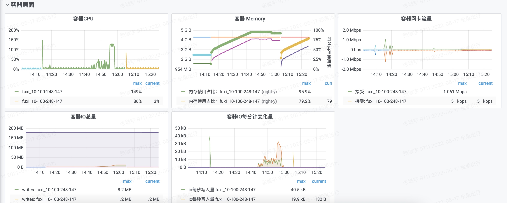
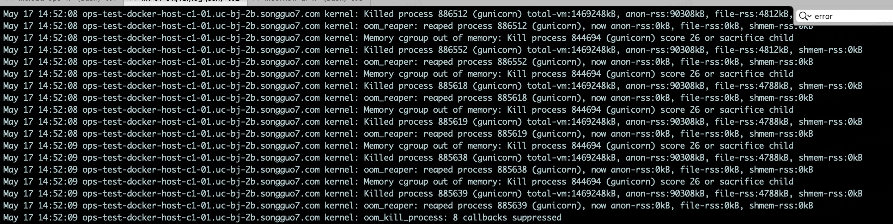

# 关于采用Nacos 作为配置中心遇到的问题
## 现象
通过监控进程数量，监控到进程在测试环境被kill掉，环境是通过docker部署的。
之前遇到过一个统计的服务通过消费者统计数据被docker kill的问题，所以，猜想可能是被docker kill了。
通过grafana 观察docker资源使用情况，看到如下图：

从图中可以看出，容器的内存和cpu都超过了规定的值。
联系SRE，确认了该场景，服务确实OOM了。



开始仔细阅读源代码，一开始以为是因为`NacosClient`的CachedData中存在循环引用导致的，改成weakref，但是并没有解决问题。


因为在服务运行的过程中，有大量的脚本执行，而且，nacos监听逻辑中会创建进程，所以怀疑是否是进程未释放。

模拟运行脚本，run 100个脚本，检查脚本是否退出。
发现问题。
因为，脚本中`os._exit(0)`函数会直接中止，所以，导致子进程不释放。
为什么要在脚本中执行`os._exit(0)`，原因是这些脚本都是通过popen打开
执行的。
```
ps = subprocess.Popen(shellstr, shell=True,
                          stdin=subprocess.PIPE, stdout=subprocess.PIPE, stderr=subprocess.PIPE,
                          close_fds=True)
shellretstr, err = ps.communicate()
shellretcode = ps.returncode
return shellretcode, shellretstr.decode("utf-8").strip(), err.decode("utf-8").strip()
```

消费者主进程-> 通过Popen创建进程执行脚本 -> wait -> 子进程推出-> shell进程退出->消费者进程退出

当子进程执行完之后，并没有退出，`ps.communicate()`会block住，导致消费阻塞。

采取的方法：在脚本执行结束后，强制退出。os._exit()

## 引入nacos sdk之后
需要动态监听配置数据的变更，在nacos sdk中新建了一个进程，发起long polling，监听数据的变化，通过进程间通信的Queue实现变更的data_id 通知，利用多线程执行callback函数。

因为脚本 和 web service 使用的是一套代码，导致在子shell的子进程中也会创建子进程，os._exit() 不会释放资源。
> Exit the process with status n, without calling cleanup handlers, flushing stdio buffers, etc.
> os._exit calls the C function _exit() which does an immediate program termination. Note the statement "can never return".
> 

## os._exit vs sys.exit
os._exit calls the C function _exit() which does an immediate program
termination. and note the statement "can never return"


sys.exit() is identical to "raise SystemExit()". It raises a Python
exception which may be caught at a higher level in the program stack. Exceptions raised (and caught or not) in a
Thread do not have any effect on the main thread, and thus don't affect
the interpreter as a whole.

## 关联问题
 - 进程 vs 线程
 - 进程间通信
 - 