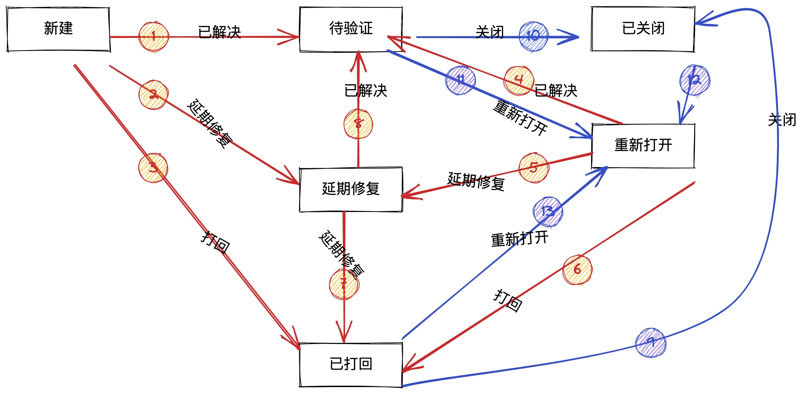

# 缺陷时长数据同步方案设计
## 需求描述
根据缺陷数据**实时**获取，某种组合筛选条件下，**开发**和**测试**的耗时分布。
缺陷状态流转图如下所示：


其中，红色线（或红色圆圈）表示 RD 耗时，蓝色线（或蓝色圆圈）表示 QA 耗时。

## 背景/现状
目前缺陷数据有两个核心表：`bug_info` 和`workflow_action_result_record`，但是无法从现有数据中直接使用简单的sql语句完成 `MySQL`服务端聚合，需要在业务侧写业务算法逐条计算才能完成，这会导致耗时随着数据量的增加呈现线性增长，当数据过10万时，接口延迟将会达到分钟级别。

## 设计方案
为了保证数据的实时准确性，需要在缺陷状态流转时，同步流转耗时记录。
存储选用MySQL存储，方便和 bug主表进行聚合运算（bug 主表要进行筛选处理）。
### schema 设计
在流转表中添加duration 字段，表征耗时周期

### 历史数据如何刷新？
```sql
select source_status,action,  target_status, action_type, action_time
from workflow_action_result_record where obj_type = '缺陷'
                                     and obj_id = 22724
                                     and action_type = '状态流转' order by action_time;
```
查询结果如下：
| source_status | action | target_status | action_type | action_time         |
|---------------|--------|---------------|-------------|---------------------|
| 新建            | 新建     | 新建            | 状态流转        | 2022-07-29 14:01:19 |
| 新建            | 打回     | 已打回           | 状态流转        | 2022-07-29 14:02:11 |
| 已打回           | 重新打开   | 重新打开          | 状态流转        | 2022-07-29 14:02:17 |
| 重新打开          | 延期修复   | 延期修复          | 状态流转        | 2022-07-29 14:02:28 |
| 延期修复          | 已解决    | 待验证           | 状态流转        | 2022-07-29 14:02:40 |
| 待验证           | 重新打开   | 重新打开          | 状态流转        | 2022-07-29 14:02:47 |
| 重新打开          | 打回     | 已打回           | 状态流转        | 2022-07-29 14:02:57 |
| 已打回           | 重新打开   | 重新打开          | 状态流转        | 2022-07-29 14:03:03 |
| 重新打开          | 已解决    | 待验证           | 状态流转        | 2022-07-29 14:03:10 |
| 待验证           | 关闭     | 已关闭           | 状态流转        | 2022-07-29 14:03:15 |
| 已关闭           | 重新打开   | 重新打开          | 状态流转        | 2022-07-29 14:03:20 |
| 重新打开          | 已解决    | 待验证           | 状态流转        | 2022-07-29 14:03:25 |
| 待验证           | 关闭     | 已关闭           | 状态流转        | 2022-07-29 14:03:28 |

按照顺序处理，更新状态的最近时间。
针对 `source` 和 `dest`，可以从hash表中获取 `source` 的最近时间，`dest`的时间就是当前记录的 `action_time`。
计算流转时间，存储流转时间。

### 新数据如何同步？
新数据只和最近的source有关系，所以只需要获取最近的source 的时间就可以了。
sql语句：
```
select source_status,action,  target_status, action_type, action_time
from workflow_action_result_record where obj_type = '缺陷'
                                     and obj_id = 22724
                                     and action_type = '状态流转'
                                     and target_status = '已关闭'
                                     and action_time < '2022-07-29 14:03:20'
                                    order by action_time desc;
```
### 时间修改动作如何同步？


